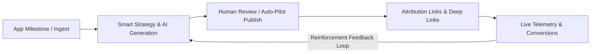

# AutoPromo Product & Technical Roadmap

> **Source**: Comprehensive synthesis of 6 Hackathon Judge & Expert Reviews (Oleh Sypiahin, Illia Levchenko, Serhii Matiushchenko, Roman Martynenko, Milana Kotova, Mike Shebalkov).

---

## 🎯 Executive Summary

AutoPromo’s core value is validated: **converting real product milestones into platform-specific, multi-provider AI marketing campaigns with human-in-the-loop publishing**. 

This roadmap addresses all reviewer critique points to transform AutoPromo from an *event-driven content helper* into a **closed-loop autonomous growth engine**.



---

## 📋 Comprehensive Feedback Matrix

| Reviewer | Business / Impact | Core Strengths Noted | Critical Weaknesses & Suggestions |
|---|:---:|---|---|
| **Oleh Sypiahin** | 8/10 · 5/10 | Real SDK, event ingestion, multi-provider fallback, variant ranking concept. | • Analytics uses bundled `mockData` while labeled as live publish rates.<br>• Strategy Engine is just fixed weights + chosen ratio, not truly adaptive.<br>• World impact is purely commercial; needs proof for indie/underserved devs. |
| **Illia Levchenko** | 5/10 · 5/10 | Twitter, Reddit, WhatsApp, Telegram integrations work; polished GitHub README. | • Video was 12m (limit was 5m) & lacked quick click-to-result demo.<br>• `npm install file:` is too complex for non-devs / marketers.<br>• Custom post wizard asked too many questions & crashed with error.<br>• Custom app connection was blocked (only saw pre-set data).<br>• Too many manual steps; wants an autonomous agent option. |
| **Serhii Matiushchenko** | 7/10 · 7/10 | In-app milestone listener -> auto promo; multi-LLM fallback; 1-tap publish. | • Needs deeper mobile app integration & in-app triggers.<br>• Missing post attribution (tracking links to installs & in-app behavior).<br>• Improve stability of demo materials. |
| **Roman Martynenko** | 8/10 · 7/10 | Developer-first workflow, SDK, Discord alerts, 1-click publishing. | • Needs attribution (clicks, signups, installs, paying users).<br>• Avoid bloat (billing/admin) & focus on the core growth loop.<br>• Anti-spam & milestone ranking (recommend when *not* to promote).<br>• Support multi-language and regional channels. |
| **Milana Kotova** | 6/10 · 7/10 | Combines app performance with promo; high multi-app scalability. | • Analytics & Post Generation are disconnected silos.<br>• Needs proactive growth intelligence (detect drops in downloads & suggest actions).<br>• Make recurring retention value clear (ongoing growth partner). |
| **Mike Shebalkov** | 8/10 · 7/10 | Full end-to-end theme integration, native compose handoff, documentation. | • Engine learns human picks, not real conversions (installs/retention).<br>• Avoid "zero risk" overclaims; document real platform constraints.<br>• Explicitly label live vs. sample metrics in UI.<br>• Add automated test suite for events, fallback, ranking, share URLs.<br>• Safeguards for review consent, milestone claims & anti-fatigue.<br>• Run 5 real app pilots; validate $12/$39 pricing economics. |

---

## 🗺️ Master Phased Roadmap

```
Phase 0: Stability, Polish & Demo Excellence (Immediate / Days 1–3)
Phase 1: Closing the Loop (Live Telemetry & Smart Attribution) (Weeks 1–2)
Phase 2: True Adaptive Growth Intelligence & Anti-Spam (Weeks 3–4)
Phase 3: Non-Technical Ingestion & Autonomous Publishing (Weeks 5–6)
Phase 4: Global Expansion, Guardrails & Real-World Pilots (Weeks 7–8)
```

---

### Phase 0: Stability, Polish & Demo Excellence (Immediate)
*Focus: Eliminate bugs, reduce cognitive friction, and ensure rock-solid demos.*

- [ ] **Fix Custom Post Wizard Crash & Form Fatigue:**
  - Fix the runtime exception causing `"This page didn't load Something went wrong on our end"` when clicking "Create Custom Post / Thread".
  - Replace the 5+ question questionnaire with a **1-click / minimal input prompt** (e.g. paste URL, raw release notes, or select 1-click presets).
- [ ] **Live Telemetry vs. Demo Sandbox Badging:**
  - Clearly label all metrics with a visible toggle/badge: `[Live Telemetry]` vs `[Demo Sandbox Data]`.
  - Prevent user confusion regarding what is simulated vs. what was fetched live from backend storage.
- [ ] **Custom App Connection Self-Serve Flow:**
  - Ensure any user can immediately enter their own App Name, Description, App Store/Play Store/GitHub URL and generate copy for *their own product* without requiring preset hardcoded apps.
- [ ] **Concise Demo Flow (< 5 Minutes):**
  - Create a laser-focused video / walkthrough demonstrating the **exact 3-step click-to-result path**:
    1. Trigger event (e.g. via SDK or 1-click test button).
    2. Auto-generated multi-platform copy + creative visual asset.
    3. One-tap native publishing + live attribution click.

---

### Phase 1: Closing the Loop (Live Telemetry & Smart Attribution)
*Focus: Connecting generated campaigns to real-world clicks, installs, and revenue.*

- [ ] **Real Backend Analytics Ingestion:**
  - Connect the Analytics dashboard directly to live database tables (events received, campaigns generated, variants published).
  - Calculate true publish rates and platform distribution from actual user events.
- [ ] **Automated Attribution & Shortlinks:**
  - Generate trackable shortlinks (e.g., `autopromo.link/c/{campaignId}`) with auto-populated UTM parameters (`utm_source`, `utm_medium`, `utm_campaign`, `utm_content`).
  - Add link redirect service that records clicks, referrer, device, and geolocation.
- [ ] **SDK Downstream Conversion Tracking:**
  - Extend SDK API with conversion methods:
    ```typescript
    AutoPromo.trackConversion({
      campaignId: 'cmp_123',
      type: 'install' | 'signup' | 'purchase',
      value?: number
    });
    ```
  - Ingest attribution tokens via deep links upon initial app launch.

---

### Phase 2: True Adaptive Growth Intelligence & Anti-Spam
*Focus: Evolving from a simple post generator into an intelligent, proactive growth copilot.*

- [ ] **Outcome-Based Reinforcement Engine:**
  - Upgrade the variant selection algorithm from a human-selection ratio to a **Multi-Armed Bandit (MAB)** model weighted by:
    $$\text{Score} = w_1 \cdot \text{CTR} + w_2 \cdot \text{Install Rate} + w_3 \cdot \text{Historical Platform Fit}$$
  - Dynamically optimize future prompt templates, tone selection, and hashtag density based on winning variants.
- [ ] **Milestone Importance & Anti-Spam Throttling:**
  - Implement milestone scoring (e.g. Major Version 2.0 = High Priority, Minor Bugfix 1.0.4 = Low Priority).
  - Add **Frequency Capping & Fatigue Guard**: Alert users when they are posting too frequently to the same platform to avoid audience burnout.
- [ ] **Proactive Growth Assistant (Anomaly Detection):**
  - Monitor app metrics and proactively suggest actions:
    > *"Download velocity is down 20% this week. We generated a re-engagement campaign highlighting your 5 most recent 5-star user reviews. [Review & Post]"*

---

### Phase 3: Non-Technical Ingestion & Autonomous Publishing
*Focus: Expanding beyond developers to solo founders, marketers, and no-code builders.*

- [ ] **No-Code Ingestion Channels:**
  - **App Store / Google Play Scraper:** Automatically detect version updates, review spikes, and rating milestones.
  - **GitHub / GitLab Releases:** Ingest git tags and release notes via webhooks.
  - **Zapier / Make / Webhook Connector:** Ingest custom business milestones from Stripe, Shopify, or Airtable.
- [ ] **Autonomous / Scheduled Agent Mode:**
  - Complement the human-in-the-loop flow with an optional **Autonomous Mode** for low-risk channels (e.g. automated Discord changelog announcements, Telegram channels, or pre-scheduled social queues).
  - Configurable approval workflows (e.g. *"Auto-publish to Discord, require manual approval for X/Twitter"*).

---

### Phase 4: Global Expansion, Guardrails & Real-World Pilots
*Focus: Compliance, accessibility, social impact, and enterprise-grade testing.*

- [ ] **Multilingual & Multi-Region Support:**
  - Auto-generate localized promotional copy for international target markets (Spanish, Japanese, German, Portuguese, Hindi, etc.).
  - Adjust cultural tones and hashtags per region.
- [ ] **Platform Compliance & Policy Guardrails:**
  - Replace absolute "zero risk" marketing claims with documented platform constraints (Twitter/X API policies, Reddit self-promotion rules, Meta terms).
  - Add safeguards: Consent confirmation for re-using user reviews, claims verification flag for milestone numbers.
- [ ] **Automated Test Suite:**
  - Unit and integration tests for:
    - SDK event delivery & offline queueing.
    - Multi-provider LLM fallback resilience.
    - URL parsing & attribution tracking.
    - Ranking algorithm convergence.
- [ ] **Social Impact & Real-World Pilots:**
  - Run pilot programs with 5 real indie/open-source projects across multiple releases.
  - Establish a dedicated **Free / Open Source Impact Tier** for non-profits, student developers, and creators in emerging markets.
  - Validate usage costs against the $12 and $39 pricing tiers to ensure sustainable unit economics.

---

## 🚦 Implementation Status Checklist

- [x] Multi-provider LLM fallback architecture
- [x] Initial SDK with event emission
- [x] Multi-platform generation (X, Reddit, WhatsApp, Telegram, Discord, Facebook)
- [x] Human-in-the-loop native compose handoff
- [x] **Phase 0**: Fix custom post flow, eliminate form fatigue, add live/demo toggle
- [x] **Phase 1**: Real backend analytics connection, attribution links & conversion tracking
- [x] **Phase 2**: Multi-Armed Bandit adaptive engine (UCB1 + CTR), anti-spam throttling, proactive growth copilot
- [x] **Phase 3**: No-code connectors (Zapier/cURL/GitHub Actions) & autonomous agent publishing routing
- [x] **Phase 4**: Automated testing suite, Open Source Impact tier, and platform compliance guidelines
